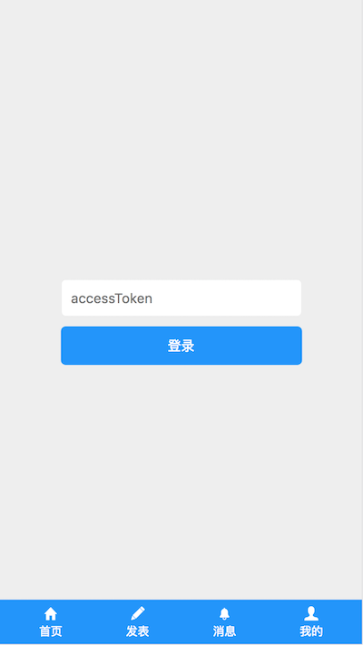

# react-cnode
基于 react + react-router + redux + styled-components + ES6 的 React 版 cnode 社区

### demo
 [demo](http://xmit.coding.me/react-cnode)

### 项目截图




### 功能
```
  1.登录
  2.列表分页，查看帖子
  3.发表帖子
  4.个人中心
  5.查看其它人的资料
```

### 构建应用
``` bash
# install dependencies
npm install

# serve with hot reload at localhost:9080
npm start

# build electron application for production
npm run build
```
